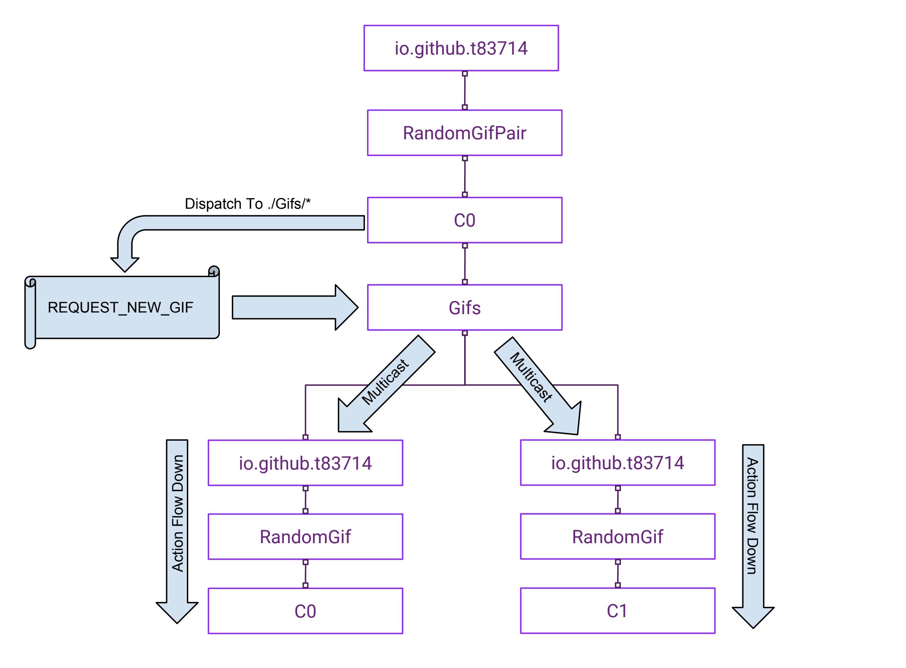

# Beginner Tutorial

## 1. Overview

This tutorial attempts to lead you through the simple process of creating a reusable component `RandomGif` (See below) and how to create a new component `RandomGifPair` by reusing the existing component using `fractal-component`. You might need some basic understandings of [ReactJs](https://reactjs.org/), [Redux](https://redux.js.org/introduction) & [Redux-Saga](https://redux-saga.js.org/). But don't worry if you haven't got a chance to look at those. As `fractal-component` tries to make things simplier by integrating with everyhting, you actually can pick up those concepts along the tutorial.

### 1.1 RandomGif Component


The `RandomGif` Component comes with a main display area that is for a Gif image and a `Get Gif` button. Once the button is clicked, this component will send a request to `https://giphy.com` to get a random gif image and display it in the display area. In the tutorial, we will try to create a highly decoupled component that doesn't make any assumptions on `outside world`. i.e.
- State Structure Independent: It doesn't rely on any particular state structure. The component's state can be moved to anywhere on the application's state tree without impacting its functionality. 
- Presentation Structure Independent: It doesn't require to be used within any particular React Component structure. i.e. It can be moved to anywhere within the Component tree without impact its functionality.
- Action Type Independent: Any action types defined by this component will never be coincidentally same with action types defined by any other components. 

### 1.2 RandomGifPair Component


The `RandomGifPair` Component will be built by reusing two `RandomGif` components. It comes with two image display areas and a `Get Gif Pair` button. Once the button is clicked, two gif images will be requested from `https://giphy.com` and displayed in the image display area. 

## 2. Initial Setup

Firstly, if you haven't install [NodeJs](https://nodejs.org/en/), you can download from here: https://nodejs.org/en/

Before we start, we need to clone the [Beginner Tutorial Repo](https://github.com/t83714/fractal-component-beginner-tutorial)

You can do so by:

```bash
git clone https://github.com/t83714/fractal-component-beginner-tutorial.git
```

You will want to checkout the `blank-template` branch to follow this tutorial (Complete demo code can be found from `master` branch).

```bash
cd fractal-component-beginner-tutorial
git checkout blank-template
```

To run the blank application, run:

```bash
npm start
```

After the application is started, you can access the application from:
```
http://localhost:3000/
```

you should see `Hello World!` in your browser.

## 3. RandomGif

### 3.1 Get Started

To start our `RandomGif` component, firstly, we need to create a `RandomGif` folder in `src` folder and then create `index.js` in `RandomGif` with the followings:

```javascript
import React from "react";
import { AppContainerUtils } from "fractal-component";

class RandomGif extends React.Component {
    constructor(props) {
        super(props);
        this.componentManager = AppContainerUtils.registerComponent(this, {
            namespace: "io.github.t83714/RandomGif"
        });
    }

    render() {
        return <div>Hello from RandomGif!</div>;
    }
}

export default RandomGif;
```

Here we define a React Component that may look very similar to an ordinary react component. The magic comes from the `constructor` method when we call [AppContainerUtils.registerComponent](/docs/api/AppContainerUtils.md#appcontainerutilsregistercomponent) to register the current component instance to `AppContainer`. Once register, a `Component Container` is created behind the scenes to maintain a more [advanced component structure](/docs/api/AppContainer.md#registercomponent). This more advanced component structure allows you to encapsulate `component state reducer`, `effects management`, `actions / events loop` etc. into a single `Component Container`. Here, to make it simple, we only create the `namespace` for our `Component Container` as suggested by line:
```javascript
namespace: "io.github.t83714/RandomGif"
```

Next, to render this newly created component, you can modify `src/main.js` to import it:
```javascript
import "@babel/polyfill";

import React from "react";
import ReactDOM from "react-dom";
import RandomGif from "./RandomGif";

ReactDOM.render(<RandomGif />, document.getElementById("root"));
```

Now, if you run the App by `npm start` & access `http://localhost:3000/`, you should see:
```
Hello from RandomGif!
```

So far, our component looks pretty much similar to an ordinary React component. However, behind the scenes, a [ComponentManager](/docs/api/ComponentManager.md) instance (the `Component Container`) has been created for this component and it's running in a portable private `namespace`: `io.github.t83714/RandomGif`.


### 3.2 Namespace

It's compulsory to specify a unique `namespace` for a `Component Container`. The `namespace` of a `Component Container` helps to make sure the `Component Container` state store & actions dispatch won't interfere other `Component Container`. 

A `Component Container` namespace is a string that may contain `/` character as namespace parts sperator. It's recommended that to construct the `Component Container Namespace` as `Reverse domain name notation` of your registered domain + `/` + `Component Name` to avoid name-space collisions. e.g. `io.github.t83714/RandomGif` as shown in sample above.

Please note: Here, the `Component Container Namespace` (e.g. `io.github.t83714/RandomGif` we supplied to `AppContainerUtils.registerComponent` method in sample code above ) is NOT the full runtime namespace (or we call `Full Namespace Path`). The `Full Namespace Path` will be automatically created for each `Component Container` instance using the following parts:
- `Namespace Prefix`: `fractal-component` will lookup this value from react component's `namespacePrefix` property (default value is empty string). It's an `interface` reserved for component users.  A component user can use it to put component namespace to a particular position (of the `Namespace Tree`) to control action delivery without impacting component's internal logic. 
- `Component Container Namespace`: That's the namespace we specified when register component. e.g. `io.github.t83714/RandomGif`
- `Component ID`: It's a unique ID auto-generated to make sure any two `Component Containers`' `Full Namespace Paths` are different.

One example of the `Full Namespace Path` could be:
```
`Namespace Prefix`          `Namespace`                 `Component ID`
  exampleApp          /  io.github.t83714/RandomGif   /       c0
```

#### 3.2.1 Namespace Tree & Action Dispatch

The `namespace` system in `fractal-component` is similar to file system path. It consists of `namespace` path parts that are seperated by `/` delimiting character. It also supports relative path calculation:

> Suppose the `Full Namespace Path` of a component is `exampleApp/io.github.t83714/RandomGif/c0`
> A `relative path`: `../..` will be resolve to `exampleApp/io.github.t83714` for this component.

All registered (in an `AppContainer`) components' `Full Namespace Paths`   forms a `Namespace Tree`. Below is an example of the `Namespace Tree` structure:


The `namespace` of the containers included in the diagram are:
- Component Container A:
    - Full namespace Path: `ExampleApp/GifPair/io.github.t83714/RandomGif/c0`
    - Namespace: `io.github.t83714/RandomGif`
    - Namespace Prefix: `ExampleApp/GifPair`
- Component Container B:
    - Full namespace Path: `ExampleApp/GifPair/io.github.t83714/RandomGif/c1`
    - Namespace: `io.github.t83714/RandomGif`
    - Namespace Prefix: `ExampleApp/GifPair`
- Component Container C:
    - Full namespace Path: `ExampleApp/io.github.t83714/Counter/c0`
    - Namespace: `io.github.t83714/Counter`
    - Namespace Prefix: `ExampleApp`

`fractal-component` allows actions to be dispatched from any namespace node in the namespace tree by specify the `relativeDispatchPath`. The `relativeDispatchPath` is calculated from `Full namespace Path` of a `Component Container`. i.e. Suppose `Component Container A` dispatches an action from `relativeDispatchPath`: 
```
../../..  (Up 3 levels from "ExampleApp/GifPair/io.github.t83714/RandomGif/c0")
```
Then, the actual action dispatch namespace node would be `ExampleApp/GifPair` in the `Namespace Tree`.

If the `relativeDispatchPath` is specified as `../../../*`, the action is a `multicast` action. For `multicast` actions, all lower levels namespace nodes will receive the actions. i.e. `multicast` actions will always be sent `down` the `Namespace Tree`. In this case, Container A & Container B will receive the `multicast` action as they are lower level nodes of dispatch point `ExampleApp/GifPair`. Container C won't receive the actions.

There are two ways to dispatch namespaced actions in component:
- In component namespaced `saga`, you will need to `yield` a `take` `effect`. See [AppContainer / ManageableComponentOptions / saga / take](/docs/api/AppContainer.md#manageablecomponentoptions)
- Outside `saga`, you can call [dispatch](/docs/api/ComponentManager.md#dispatch) method of `ComponentManager`. 

### 3.3 A simple Switch / Namespaced State

Next, let's add a simple switch function to our `RandomGif` component. It's not part of required functionalities of our `RandomGif` component. However, implemnt this simple function will help us to understand the some basics that `fractal-component` brought to the component state management area.

Firstly, we want to modify `src/RandomGif/index.js` to add a `switch` button & initialise component state:
```javascript
import React from "react";
import { AppContainerUtils } from "fractal-component";

class RandomGif extends React.Component {
    constructor(props) {
        super(props);
        // --- Component state need to be initialised
        // --- before `registerComponent` method call
        this.state = {
            isSwitchOn: false
        };
        this.componentManager = AppContainerUtils.registerComponent(this, {
            namespace: "io.github.t83714/RandomGif"
        });
    }

    render() {
        return (
            <button onClick={() => {}}>
                {this.state.isSwitchOn ? "Switch ON" : "Switch OFF"}
            </button>
        );
    }
}

export default RandomGif;
```

To make the button clickable and display correct status (`Switch ON` or `Switch OFF`), we just need to mutate component state `this.state` and make sure `this.state.isSwitchOn` has been set correct value (`true` or `false`) when the button is clicked.

In a React Component, to achieve that, we usually can mutate `this.state` by calling `this.setState` method. However, for a `ComponentManager` managed component, we cannot do that because `this.state` is actually managed by the `ComponentManager` and it's part of [global application Redux state store](https://redux.js.org/basics/store). In fact, if you try to call `this.setState` in a managed component, you will get an Error:

>Error: This component is managed by `fractal-component`. You should dispatch action to mutate component state.

i.e. If you want to mutate the component state `this.state`, you should trigger an action and mutate the component state in a `namespaced` component [reducer](https://redux.js.org/basics/reducers). You can provide this reducer when call [AppContainerUtils.registerComponent](/docs/api/AppContainerUtils.md#appcontainerutilsregistercomponent) method.

Next, you need to define the [Action](https://redux.js.org/basics/actions) before we can dispatch the action in `onClick` event handler of our switch button. To do so, we need to create a file `src/RandomGif/actions/types.js` with the `Action Type` definition:
```javascript
export const CLICK = Symbol("CLICK");
```

Here, `fractal-component`'s action dispatch system requires all action types are [Symbols](http://2ality.com/2014/12/es6-symbols.html). A Redux App usually won't define `Action Type` as `Symbols` as they are not serialisable and you will need to serialise `Actions` when you try to implement [Time Travel](https://www.ibm.com/developerworks/library/wa-manage-state-with-redux-p4-david-geary/index.html#N10076) alike features in your app. However, `fractal-component` has sovled this by providing an `Action` serialisation / de-serialisation solution via its `ActionRegistry`. See [AppContainerUtils.serialiseAction](/docs/api/AppContainerUtils.md#appcontainerutilsserialiseaction) & [AppContainerUtils.deserialiseAction](/docs/api/AppContainerUtils.md#appcontainerutilsdeserialiseaction) for more info.

Next, create a file `src/RandomGif/actions/index.js` with all action creator function definitions for your component:
```javascript
import * as actionTypes from "./types";

export function click() {
    return {
        type: actionTypes.CLICK
    };
}
```

Then, we will need to create our `reducer` in `src/RandomGif/reducers/index.js`:
```javascript
import * as actionTypes from "../actions/types";

const reducer = function(state, action) {
    switch (action.type) {
        case actionTypes.CLICK:
            return {
                ...state,
                isSwitchOn: state.isSwitchOn ? false : true
            };
        default:
            return state;
    }
};
export default reducer;
```

You probably have noticed that the reducer is a `namespaced` reducer. i.e. 
- It only receives the actions that the component receives.
- It only sees the component state `this.state`.

We now can complete our `switch button` feature by importing everything above into `src/RandomGif/index.js`:

```javascript
import React from "react";
import { AppContainerUtils } from "fractal-component";
import * as actionTypes from "./actions/types";
import reducer from "./reducers";
import { click } from "./actions";

class RandomGif extends React.Component {
    constructor(props) {
        super(props);
        this.state = {
            isSwitchOn: false
        };
        this.componentManager = AppContainerUtils.registerComponent(this, {
            namespace: "io.github.t83714/RandomGif",
            // --- register all action types so that actions are serialisable
            actionTypes,
            reducer
        });
    }

    render() {
        return (
            <button onClick={() => {
                this.componentManager.dispatch(click());
            }}>
                {this.state.isSwitchOn ? "Switch ON" : "Switch OFF"}
            </button>
        );
    }
}

export default RandomGif;
```
> Please note: In order to make your component actions serialisable, you need to register all your component action types via `AppContainerUtils.registerComponent` method's [ManageableComponentOptions.actionTypes](/docs/api/AppContainer.md#manageablecomponentoptions)

If you run the app via `npm start`, you will find the button text will reflects the `switch status` along your clicks. You can open the [Redux Devtool](https://github.com/zalmoxisus/redux-devtools-extension) to observe the component state changes.


### 3.4 Request GIF / Namespaced Saga

In the section, we are going to implment the main logic of `RandomGif` component:
- UI includes a `Get Gif` button & a GIF image display area
- When click the button, the component should request remote API for a new GIF URL and display the GIF in the display area

Firstly, we need to update the initial component state to the followings (in `src/RandomGif/index.js`):
```javascript
this.state = {
    isLoading: false, //--- whether the component is requesting a GIF from remote server
    imageUrl: null, // --- received GIF image URL
    error: null // --- whether an error is captured during last network request
};
```

Then, the `render()` method needs to be updated with required UI (in `src/RandomGif/index.js`):
```javascript
render() {
    return (
        <div>
            <div>
                {/* Only show image when `this.state.imageUrl` is received */}
                {this.state.imageUrl &&
                    !this.state.isLoading &&
                    !this.state.error && (
                        
                    )}
                {(!this.state.imageUrl || this.state.isLoading) &&
                    !this.state.error && (
                        <p>
                            {this.state.isLoading
                                ? "Requesting API..."
                                : "No GIF loaded yet!"}
                        </p>
                    )}
                {this.state.error && (
                    <p>{`Failed to request API: ${this.state.error}`}</p>
                )}
            </div>
            <div>
                <button
                    onClick={() => {
                        this.componentManager.dispatch(
                            // --- dispatch `REQUEST_NEW_GIF` action
                            actions.requestNewGif()
                        );
                    }}
                    disabled={this.state.isLoading}
                >
                {/* When requesting API, the button shows  `Requesting API...` */}
                    {this.state.isLoading ? "Requesting API..." : "Get Gif"}
                </button>
            </div>
        </div>
    );
}
```

To implement our logic, we need to define the following action types (in `src/RandomGif/actions/types.js`):
```javascript
// --- Trigger by `Get Gif` button. `Saga` monitor this action to trigger network request
export const REQUEST_NEW_GIF = Symbol("REQUEST_NEW_GIF");

// --- Once a GIF url is received, this action will be used to update `this.state` via reducer
export const RECEIVE_NEW_GIF = Symbol("RECEIVE_NEW_GIF");

// --- Update state with any possible error during the network request
export const REQUEST_NEW_GIF_ERROR = Symbol("REQUEST_NEW_GIF_ERROR");
```

And define the following action creators (in `src/RandomGif/actions/index.js`):
```javascript
import * as actionTypes from "./types";

export function requestNewGif() {
    return {
        type: actionTypes.REQUEST_NEW_GIF
    };
}

export function receiveNewGif(imgUrl) {
    return {
        type: actionTypes.RECEIVE_NEW_GIF,
        payload: imgUrl
    };
}

export function requestNewGifError(error) {
    return {
        type: actionTypes.REQUEST_NEW_GIF_ERROR,
        payload: error
    };
}
```

Next, we need to update `reducer` with the following logic:
```javascript
import * as actionTypes from "../actions/types";

const reducer = function(state, action) {
    switch (action.type) {
        case actionTypes.REQUEST_NEW_GIF:
        // --- when receive `REQUEST_NEW_GIF`, set state.isLoading to true
        // --- and error to null
            return {
                ...state,
                isLoading: true,
                error: null
            };
        case actionTypes.RECEIVE_NEW_GIF: {
        // --- Update state.imageUrl with received GIF image URL
            const imageUrl = action.payload;
            return {
                ...state,
                isLoading: false,
                error: null,
                imageUrl
            };
        }
        case actionTypes.REQUEST_NEW_GIF_ERROR:
        // --- Update state.error with any errors during the network request
            return {
                ...state,
                isLoading: false,
                error: action.payload
            };
        default: return state;
    }
};
export default reducer;
```

Next, we need to create a `saga` to:
- monitor the `REQUEST_NEW_GIF` and request API
- Dispatch `RECEIVE_NEW_GIF` with API request result (the GIF url)
- Dispatch `REQUEST_NEW_GIF_ERROR` with any possible error

A `saga` is a [Generator Function](https://developer.mozilla.org/en-US/docs/Web/JavaScript/Reference/Statements/function*) run an event loop or managing side-effects. It is run by [redux-saga](https://redux-saga.js.org) internally. In the `saga`, you can use [yield operator](https://developer.mozilla.org/en-US/docs/Web/JavaScript/Reference/Operators/yield) to `yield` a `effect description object`. `redux-saga` will creata the effect, get result back to you via the return value of the `yield operator` and resume your `saga`'s execution. More info on this can be found from [ManageableComponentOptions.saga](/docs/api/AppContainer.md#manageablecomponentoptions)

When your `saga` is run, an `effects` parameter is passed to your `saga` contains a list of `effect creator functions`. You can use the provided `effect creator functions` to create effects.

You can create a file (`src/RandomGif/sagas/index.js`) with the followings:
```javascript
import * as actionTypes from "../actions/types";
import * as actions from "../actions";

// --- request `giphy` API for random GIF url
// --- return a Promise
function fetchGif(apiKey) {
    return fetch(
        `https://api.giphy.com/v1/gifs/random?api_key=${apiKey}`
    ).then(response => response.json()).catch(error=>{
        throw new Error("Giphy API key is invalid or exceeded its daily / hourly limit.");
    });
}

const mainSaga = function*(effects) {
    try{
        while(true){
            // --- create an effect of taking an `REQUEST_NEW_GIF` action 
            // --- from this Component's action channel
            // --- Until an action is available for being taken, this saga will not resume its execution.
            const action = yield effects.take(actionTypes.REQUEST_NEW_GIF);
            // --- Create an `call` effect to execute a sub-routine
            // --- Your saga will not resume until sub-routine is complete
            // --- If you don't want the sub-routine block your saga's execution,
            // --- you can create a `fork` effect instead
            // --- you should put a correct API key here instead of `xxxxxxxxxxxx`
            const response = yield effects.call(fetchGif, "xxxxxxxxxxxx"); 
            const imgUrl = response.data.fixed_width_small_url;
            // --- dispatch an action with new img Url as payload
            yield effects.put(actions.receiveNewGif(imgUrl));
        }
    }catch(e){
        yield effects.put(actions.requestNewGifError(e));
    }
};
export default mainSaga;
```

You may notice that we used a `while(true)` loop for monitor all `REQUEST_NEW_GIF` action. You don't need to worry about this `while` loop. It won't occupy the main thread of the web browser and cause any render issue as line:
```javascript
const action = yield effects.take(actionTypes.REQUEST_NEW_GIF);
```
will not return until a `REQUEST_NEW_GIF` is received.

You don't have to always write a `while(true)` `event loop`. You can use: [takeEvery](https://github.com/redux-saga/redux-saga/tree/v1.0.0-beta.2/docs/api#takeeverypattern-saga-args), [takeLatest](https://github.com/redux-saga/redux-saga/tree/v1.0.0-beta.2/docs/api#takelatestpattern-saga-args) or [takeLeading](https://github.com/redux-saga/redux-saga/tree/v1.0.0-beta.2/docs/api#takeleadingpattern-saga-args) effect creator to acheive the similar function. They are provided as shortcut and implmented using `take` effect. e.g. the above `while` loop can also be re-written to:
```javascript
const mainSaga = function*(effects) {
    yield effects.takeLeading(actionTypes.REQUEST_NEW_GIF, function*(action) {
        try{
            const response = yield effects.call(fetchGif, "xxxxxxxxxxxx"); 
            const imgUrl = response.data.fixed_width_small_url;
            yield effects.put(actions.receiveNewGif(imgUrl));
        }catch(e){
            yield effects.put(actions.requestNewGifError(e));
        }
    });
};

```


In the end, you can add the `saga` into your `Component Container` via `AppContainerUtils.registerComponent` method's [ManageableComponentOptions.saga option](/docs/api/AppContainer.md#manageablecomponentoptions)

```javascript
import React from "react";
import { AppContainerUtils } from "fractal-component";
import * as actionTypes from "./actions/types";
import reducer from "./reducers";
import * as actions from "./actions";
import saga from "./sagas";

class RandomGif extends React.Component {
    constructor(props) {
        super(props);
        this.state = {
            isLoading: false,
            imageUrl: null,
            error: null
        };
        this.componentManager = AppContainerUtils.registerComponent(this, {
            namespace: "io.github.t83714/RandomGif",
            actionTypes,
            reducer,
            // --- register saga
            saga
        });
    }

    render() { ... }
}

export default RandomGif;
```

If you run the app via `npm start`, you will find that once click the `Get Gif` button, a GIF image is shown in the display area.


### 3.5 Styling / Component Namespace Data

So far, our `RandomGif` component doesn't come with any styles. Of course, we can style our component using traditional global CSS files. However, here, we recommended the `In-Component Styling` approach using [JSS library](http://cssinjs.org). Besides the benefits described [here](http://cssinjs.org/benefits), more importantly, this approach allows us to encapsulate our component UI without any impact to the global CSS space.

To style our component, we firstly need to write our component style CSS in [JSON format](http://cssinjs.org/json-api)(in file `src/RandomGif/styles/index.js`):
```javascript
import color from "color"; // --- use `color` lib for color caclulation
const styles = {
    table: {
        display: "flex",
        "flex-wrap": "wrap",
        margin: "0.2em 0.2em 0.2em 0.2em",
        padding: 0,
        "flex-direction": "column",
        width: "20em"
    },
    cell: {
        "box-sizing": "border-box",
        "flex-grow": 1,
        width: "100%",
        overflow: "hidden",
        padding: "0.2em 0.2em",
        border: `solid 2px ${color("slategrey").fade(0.5)}`,
        "border-bottom": "none",
        "background-color": "#f7f7f7",
        display: "flex",
        "align-items": "center",
        "justify-content": "center",
        "&:last-child": {
            "border-bottom": `solid 2px ${color("slategrey").fade(
                0.5
            )} !important`
        }
    },
    "image-container": {
        height: "15em"
    },
    image: {
        width: "100%",
        height: "100%"
    }
};
export default styles;
```

To create CSS stylesheet from the `JSON format stylesheet declaration` and attach to browser global CSS space, we generally need the following code:
```javascript
import jss from "jss";
import jssDefaultPreset from "jss-preset-default";
import styles from "./styles";

const styleSheet = jss.setup(jssDefaultPreset()) // --- setup a JSS instance with with default plugins
.createStyleSheet(styles)  // --- Compile styles
.attach(); // --- render to browser, insert it into DOM
```

If we want to remove the compiled stylesheet from browser, we can:
```javascript
styleSheet.detach();
```

We can't simply copy those into our component's `index.js` as we want to make sure:
- Styles are only compiled & insert into DOM once. 
    -  No matter how many component instances are mounted. Styles are only compile when the first instance are mounted.
- Styles are removed from browser only after all instances of the component are unmounted.

To achieve that, we can use the `Component Namespace Data` & `Component Namespace Life Cycle Callback` feature of `fractal-component`. When we register our React Component using [AppContainerUtils.registerComponent](/docs/api/AppContainerUtils.md#appcontainerutilsregistercomponent) method, we can opt to register `namespaceInitCallback` & `namespaceDestroyCallback` through [ManageableComponentOptions](/docs/api/AppContainer.md#manageablecomponentoptions).

- `namespaceInitCallback`: this callback will only be called once when `Component Namespace` `io.github.t83714/RandomGif` has just been created (it's also the time when the first instance of the registered React Component is mounted). Moreover, any value you return from this callback will be kept as `Component Namespace Data` and can be retrieved anytime before the namespace is destroyed using [ComponentManager.getNamespaceData()](/docs/api/ComponentManager.md) method.
- `namespaceDestroyCallback`: this callback will only be called once after `Component Namespace` `io.github.t83714/RandomGif` is destroyed (it's also the time when the last instance of the the registered React Component is unmounted). You will receive the `Component Namespace Data` as the only parameter of the callback function.

To setup the stylesheet for our component, we can modify `src/RandomGif/index.js` to the followings:

```javascript
import React from "react";
import { AppContainerUtils } from "fractal-component";
import * as actionTypes from "./actions/types";
import reducer from "./reducers";
import * as actions from "./actions";
import saga from "./sagas";
import jss from "jss";
import jssDefaultPreset from "jss-preset-default";
import styles from "./styles";

class RandomGif extends React.Component {
    constructor(props) {
        super(props);
        // --- initialise component state
        this.state = {
            isLoading: false,
            imageUrl: null,
            error: null
        };
        this.componentManager = AppContainerUtils.registerComponent(this, {
            namespace: "io.github.t83714/RandomGif",
            // --- register all action types so that actions are serialisable
            actionTypes,
            reducer,
            saga,
            namespaceInitCallback: componentManager => {
                const styleSheet = jss
                    .setup(jssDefaultPreset())
                    .createStyleSheet(styles, {
                        generateClassName: componentManager.createClassNameGenerator()
                    })
                    .attach();
                // --- store `styleSheet` as `Component Namespace Data`
                return { styleSheet }; 
            },
            namespaceDestroyCallback: ({ styleSheet }) => {
                // --- received previously returned `Component Namespace Data` as the only parameter
                // --- remove stylesheet from browser
                styleSheet.detach();
            }
        });
    }

    render() { ... }
}
export default RandomGif;
```

Next, we need to update `render()` method to use our stylesheet:

```javascript
render() {
    // --- retrieve styleSheet from `Component Namespace Data`
    const { styleSheet } = this.componentManager.getNamespaceData();
    // --- get all class names included in this stylesheet
    const { classes } = styleSheet;
    return (
        <div className={classes.table}>
            <div className={classes.cell}>RandomGif</div>
            <div
                className={`${classes.cell} ${classes["image-container"]}`}
            >
                {this.state.imageUrl &&
                    !this.state.isLoading &&
                    !this.state.error && (
                        
                    )}
                {(!this.state.imageUrl || this.state.isLoading) &&
                    !this.state.error && (
                        <p>
                            {this.state.isLoading
                                ? "Requesting API..."
                                : "No GIF loaded yet!"}
                        </p>
                    )}
                {this.state.error && (
                    <p>{`Failed to request API: ${this.state.error}`}</p>
                )}
            </div>
            <div className={`${classes.cell} `}>
                <button
                    onClick={() => {
                        this.componentManager.dispatch(
                            actions.requestNewGif()
                        );
                    }}
                    disabled={this.state.isLoading}
                >
                    {this.state.isLoading ? "Requesting API..." : "Get Gif"}
                </button>
            </div>
        </div>
    );
}
```

If you run the app via `npm start`, you will find that the component now comes with styles as shown below:


### 3.6 Encapsulation & External Interfaces

Now, the required UI & functionalities of our `RandomGif` component have all been completed. However, we still need to do the followings to make sure the component is easy to be reused:

#### 3.6.1 Define External Action Interfaces

##### 3.6.1.1 Incoming Actions / `allowedIncomingMulticastActionTypes`

By default, the `Component Container` won't accept any multicast actions (non-multicast & direct addressed actions will always be accepted though). To make sure the component users can send `REQUEST_NEW_GIF` actions to this component in order to programmingly trigger the image loading, we can set the incoming actions rulse using `allowedIncomingMulticastActionTypes` option when register our component:

```javascript
this.componentManager = AppContainerUtils.registerComponent(this, {
    namespace: "io.github.t83714/RandomGif",
    actionTypes,
    reducer,
    saga,
    // --- Only allow `actionTypes.REQUEST_NEW_GIF` to be received by component
    allowedIncomingMulticastActionTypes: [actionTypes.REQUEST_NEW_GIF],
    namespaceInitCallback: componentManager => {
        const styleSheet = jss
            .setup(jssDefaultPreset())
            .createStyleSheet(styles, {
                generateClassName: componentManager.createClassNameGenerator()
            })
            .attach();
        return { styleSheet };
    },
    namespaceDestroyCallback: ({ styleSheet }) => {
        styleSheet.detach();
    }
});
```

If you want your component to accept any actions, you can set `allowedIncomingMulticastActionTypes` to `"*"`.

> You should avoid setting `allowedIncomingMulticastActionTypes` to `"*"` unless you tried to create a `forwarder` type component. One example is the [ToggleButton](/examples/ToggleButton)

##### 3.6.1.2 `Outgoing External Actions`

It would be useful if our component sends out actions at different stages of requesting data from remote API so that other part of the program can monitor the actions and can act accordingly. We are going to define the following `Outgoing External Actions` (in `src/RandomGif/actions/types.js`):

```javascript
// --- dispatch when a NEW Random Gif URl is received from API
export const NEW_GIF = Symbol("NEW_GIF");
// --- dispatch when a request is just sent
export const LOADING_START = Symbol("LOADING_START");
// --- dispatch when a request is complete 
export const LOADING_COMPLETE = Symbol("LOADING_COMPLETE");
```

And, we need to define the following action creator functions accordingly (in `src/RandomGif/actions/index.js`):

```javascript
export function newGif() {
    return {
        type: actionTypes.NEW_GIF
    };
}

export function loadingStart() {
    return {
        type: actionTypes.LOADING_START
    };
}

export function loadingComplete(error = null) {
    return {
        type: actionTypes.LOADING_COMPLETE,
        payload: {
            isSuccess: error ? false : true,
            error
        }
    };
}
```

Next, we can modify `saga` to dispatch those actions at appropriate places:

```javascript
const mainSaga = function*(effects) {
    try{
        while(true){
            /**
             * Dedicated LOADING_START action to notify interested components outside
             * This component will not use it in any way
             */
            yield effects.put(actions.loadingStart(), "../../../*");

            // --- create an effect of taking an `REQUEST_NEW_GIF` action from this Component's action channel
            // --- Until an action is available for being taken, this saga will not resume its execution.
            const action = yield effects.take(actionTypes.REQUEST_NEW_GIF);
            const response = yield effects.call(fetchGif, "Y4P38sTJAgEBOHP1B3sVs0Jtk01tb6fA");
            const imgUrl = response.data.fixed_width_small_url;
            yield effects.put(actions.receiveNewGif(imgUrl));

            /**
             * The optional second `relativeDispatchPath` parameter defines
             * the relative (from current component full namespace path) namespace dispatch path.
             * i.e. suppose the current component full namespace path is:
             *  namespacePrefix        namespace                  random component ID
             *    `xxxxxx`   /  `io.github.t83714/RandomGif`  /        `cx`
             * e.g. `exampleApp/Gifs/io.github.t83714/RandomGif/c0`
             * If `relativeDispatchPath` is `../../../*`, the effective dispatch path is `exampleApp/Gifs/*`.
             * Although, theoretically, you could use `relativeDispatchPath` & ".." to dispatch the action
             * into any namespace, you should throw the action just out of the your component 
             * as you are supposed to know nothing about outside world as a component author.
             */
            //--- optional second `relativeDispatchPath` parameter
            //--- specify the action dispatch path
            yield effects.put(actions.newGif(), "../../../*");

            /**
             * Dedicated LOADING_COMPLETE action to notify interested components outside
             */
            yield effects.put(actions.loadingComplete(), "../../../*");
        }
    }catch(e){
        yield effects.put(actions.requestNewGifError(e));
        /**
         * Dedicated LOADING_COMPLETE action to notify interested components outside
         * This component will not use it in any way
         */
        yield effects.put(actions.loadingComplete(e), "../../../*");
    }
};
```

##### 3.6.1.3 Export External Actions Types

We will also want to export those external actions types (`in src/RandomGif/index.js`) for potential component users:

```javascript
//--- actions component may send out
const exposedActionTypes = {
    NEW_GIF: actionTypes.NEW_GIF,
    LOADING_START: actionTypes.LOADING_START,
    LOADING_COMPLETE: actionTypes.LOADING_COMPLETE,
    REQUEST_NEW_GIF: actionTypes.REQUEST_NEW_GIF
};
//--- action component will accept
const exposedActions = {
    requestNewGif: actions.requestNewGif
};

/**
 * expose actions for component users
 */
export { exposedActionTypes as actionTypes, exposedActions as actions };
```

#### 3.6.2 Component Config Properties

We will want to define the following React Component Properties to allow users to config our component's functionalities:

```javascript
RandomGif.propTypes = {
    // --- User can set `showButton` to false to hide the button
    showButton: PropTypes.bool,
    // --- Allow component user to set their own Giphy.com API key
    apiKey: PropTypes.string,
    // --- Allow user replace component built stylesheet
    styles: PropTypes.object,
    /*
    * Allow user specify the `AppContainer` for this component through component property
    */
    appContainer: PropTypes.instanceOf(AppContainer)
};

// --- set component properties default value
RandomGif.defaultProps = {
    showButton: true,
    apiKey: "Y4P38sTJAgEBOHP1B3sVs0Jtk01tb6fA"
};
```

> Component users generally don't need to set `appContainer` to explicitly provide `AppContainer` instance to the component as `AppContainerUtils` will auto-create an `appContainer` and reuse it if `AppContainerUtils` can't find a `appContainer` at [various places](/docs/api/AppContainerUtils.md#appcontainerutilsgetappcontainer)

> Besides the component properties defined above, users can always set `namespacePrefix` property to set the `namespace prefix` of the component.

##### 3.6.2.1 `showButton`

To hide `Get Gif` button depends on `showButton` property, we can update `Get Gif` button JSX in `render()` to the followings:
```javascript
{this.props.showButton && (
    <div className={`${classes.cell} `}>
        <button
            onClick={() => {
                this.componentManager.dispatch(
                    actions.requestNewGif()
                );
            }}
            disabled={this.state.isLoading}
        >
            {this.state.isLoading
                ? "Requesting API..."
                : "Get Gif"}
        </button>
    </div>
)}
```

##### 3.6.2.2 `apiKey`

To allow users to update `apiKey`, we need to update `saga` to the followings:

```javascript
const mainSaga = function*(effects, apiKey) {
    ...
    const response = yield effects.call(fetchGif, apiKey);
    ...
};
```

And then, we need to `prefill` the last parameter of the `saga` when register the component:

```javascript
import partialRight from "lodash/partialRight";
...
this.componentManager = AppContainerUtils.registerComponent(this, {
    ...
    saga: partialRight(saga, props.apiKey),
    ...
});
```

##### 3.6.2.3 `styles`

In order to allow users to override the component built-in stylesheet, we need to update the `namespaceInitCallback` & `namespaceDestroyCallback` to the followings:

```javascript
this.componentManager = AppContainerUtils.registerComponent(this, {
    ...
    namespaceInitCallback: componentManager => {
        let jssRef;
        if(!props.styles){
            // --- if use built-in style, we want to make sure 
            // --- that this component use its own jss setting
            jssRef = jss.setup(jssDefaultPreset());
        }else{
            jssRef = jss
        }
        const styleSheet = jssRef
            .createStyleSheet(props.styles ? props.styles : styles, {
                // --- use componentManager's createClassNameGenerator
                generateClassName: componentManager.createClassNameGenerator()
            })
            .attach();
        return { styleSheet };
    },
    namespaceDestroyCallback: ({ styleSheet }) => {
        styleSheet.detach();
    }
});
```

## 4 RandomGifPair

In this section, we are going to demonstrate how to reuse `RandomGif` component to create a new reusable `RandomGifPair`. The new `RandomGifPair` component will come with two image display areas and a Get Gif Pair button. Once the button is clicked, two gif images will be requested from https://giphy.com and displayed in the image display area.


### 4.1 Get Started

To start our `RandomGifPair` component, firstly, we need to create a `RandomGifPair` folder in `src` folder and then create stlye file `index.js` in `RandomGifPair/styles`. Its content can be found from [here](https://github.com/t83714/fractal-component-beginner-tutorial/blob/master/src/RandomGifPair/styles/index.js)

Next, we need to create the component entry point `index.js` in `RandomGifPair` with the followings:

```javascript
import React from "react";
import PropTypes from "prop-types";
import { AppContainerUtils, AppContainer } from "fractal-component";
import RandomGif, { actions as randomGifActions, actionTypes as randomGifActionTypes } from "../RandomGif";

import jss from "jss";
import jssDefaultPreset from "jss-preset-default";
import styles from "./styles";

class RandomGifPair extends React.Component {
    constructor(props) {
        super(props);
        this.state = {};

        this.componentManager = AppContainerUtils.registerComponent(this, {
            namespace: "io.github.t83714/RandomGifPair",
            namespaceInitCallback: componentManager => {
                const styleSheet = jss
                    .setup(jssDefaultPreset())
                    .createStyleSheet(props.styles ? props.styles : styles, {
                        generateClassName: componentManager.createClassNameGenerator()
                    })
                    .attach();
                return { styleSheet };
            },
            namespaceDestroyCallback: ({ styleSheet }) => {
                styleSheet.detach();
            }
        });
    }

    render() {
        const { styleSheet } = this.componentManager.getNamespaceData();
        const { classes } = styleSheet;
        return (
            <div className={classes.table}>
                <div className={classes.cell}>RandomGif Pair</div>
                <div className={`${classes.cell}`}>
                    <div>
                        <RandomGif
                            showButton={false}
                            apiKey={this.props.apiKey}
                            namespacePrefix={`${
                                this.componentManager.fullPath
                            }/Gifs`}
                            // --- pass down appContainer in case users want to specify `appContainer`
                            appContainer={this.props.appContainer}
                        />
                    </div>
                    <div>
                        <RandomGif
                            showButton={false}
                            apiKey={this.props.apiKey}
                            namespacePrefix={`${
                                this.componentManager.fullPath
                            }/Gifs`}
                            // --- pass down appContainer in case users want to specify `appContainer`
                            appContainer={this.props.appContainer}
                        />
                    </div>
                </div>
                {this.props.showButton && (
                    <div className={`${classes.cell} `}>
                        <button
                            onClick={() => {
                                this.componentManager.dispatch(
                                    randomGifActions.requestNewGif(),
                                    // --- sent multicast actions 
                                    // --- and flow down to all namespace paths under `${this.componentManager.fullPath}/Gifs/`
                                    "./Gifs/*"
                                );
                            }}
                            disabled={this.state.isLoading}
                        >
                            {this.state.isLoading
                                ? "Loading..."
                                : "Get Gif Pair"}
                        </button>
                    </div>
                )}
            </div>
        );
    }
}

RandomGifPair.propTypes = {
    showButton: PropTypes.bool,
    apiKey: PropTypes.string,
    styles: PropTypes.object,
    appContainer: PropTypes.instanceOf(AppContainer)
};

RandomGifPair.defaultProps = {
    showButton: true
};

export default RandomGifPair;
```

In `index.js`, we imported component `RandomGif` and configure it as:
```jsx
<RandomGif
    // --- hide `RandomGif`'s button
    showButton={false}
    apiKey={this.props.apiKey}
    namespacePrefix={`${
        this.componentManager.fullPath
    }/Gifs`}
    // --- pass down appContainer in case users want to specify `appContainer`
    appContainer={this.props.appContainer}
/>
```
Here, we set `namespacePrefix` to `${this.componentManager.fullPath}/Gifs` so that the namespace path of `RandomGif` components included by our new `RandomGifPair` will be always under `RandomGifPair`'s namespace path. The actual `Namespace Tree` structure is shown as below:



From the `Namespace Tree` structure, we can tell that to send multicast actions to both `RandomGif` components, we just need to dispatch to `relativeDispatchPath`: `./Gifs/*`. Thus, in `index.js`, we use the following code to dispatch `REQUEST_NEW_GIF` actions to `RandomGif` components when the button is clicked:
```javascript
this.componentManager.dispatch(
    randomGifActions.requestNewGif(),
    "./Gifs/*"
);
```


Next, to render this newly created component, you can modify `src/main.js` to import it:
```javascript
import "@babel/polyfill";
import React from "react";
import ReactDOM from "react-dom";
import RandomGif from "./RandomGif";
import RandomGifPair from "./RandomGifPair";

ReactDOM.render(
    <div>
        <div>
            <RandomGif />
        </div>
        <div>
            <RandomGifPair />
        </div>
    </div>,
    document.getElementById("root")
);
```

Now, if you run the App by `npm start` & access `http://localhost:3000/`, you should see both `RandomGif` & the newly created `RandomGifPair` component.

### 4.3 Incoming / Outgoing Actions

Similar to `RandomGif`, we need to define Incoming / Outgoing Actions as external programming interfaces so that component users can interact with the component programmingly easily (in `src/RandomGifPair/actions/types.js`):
``` javascript
// --- Incoming Action. External user can send this action to trigger Gif Pair loading
export const REQUEST_NEW_PAIR = Symbol("REQUEST_NEW_PAIR");
// --- Out-going actions.
// --- Dispatch when loading starts
export const LOADING_START = Symbol("LOADING_START");
// --- Dispatch when loading complete
export const LOADING_COMPLETE = Symbol("LOADING_COMPLETE");
```

And, we can define the following action creator functions accordingly (in `src/RandomGifPair/actions/index.js`):
```javascript
import * as actionTypes from "./types";

export function requestNewPair() {
    return {
        type: actionTypes.REQUEST_NEW_PAIR
    };
}

export function loadingStart() {
    return {
        type: actionTypes.LOADING_START
    };
}

export function loadingComplete(error = null) {
    return {
        type: actionTypes.LOADING_COMPLETE,
        payload: {
            isSuccess: error ? false : true,
            error
        }
    };
}
```

#### 4.3.1 `REQUEST_NEW_PAIR` action

To support `REQUEST_NEW_PAIR`, we firstly need to modify the `onClick` handler of the `Get Gif Pair` button to the following:
```jsx
<button
    onClick={() => {
        this.componentManager.dispatch(
            actions.requestNewPair()
        );
    }}
    disabled={this.state.isLoading}
>
```

Then, we need to create `saga` (in `src/RandomGifPair/sagas/index.js`) as the followings:

```javascript
import * as actions from "../actions";
import * as actionTypes from "../actions/types";
import {
    actions as RandomGifActions,
    actionTypes as RandomGifActionTypes
} from "../../RandomGif";

function* mainSaga(effects) {
    // --- monitor `REQUEST_NEW_PAIR` and send multicast actions to RandomGifs
    yield effects.takeEvery(
        actionTypes.REQUEST_NEW_PAIR,
        function*() {
            yield effects.put(
                RandomGifActions.requestNewGif(),
                "./Gifs/*"
            );
        }
    );
}

export default mainSaga;
```

At last, modify `src/RandomGifPair/index.js` to register the saga accordingly (when calls `AppContainerUtils.registerComponent()`).

#### 4.3.2 `LOADING_START` & `LOADING_COMPLETE` actions

To support, we need to find a way to capture the `LOADING_START` & `LOADING_COMPLETE` actions emitted from `RandomGif` component. From section 3.6.1.2, you can tell `LOADING_START` & `LOADING_COMPLETE` will be thrown just out of `RandomGif` Container (i.e. the first namespace part above `RandomGif` in the `Namespace Tree`). Thus, both actions will be dispatched to namespace path: `${this.componentManager.fullPath}/Gifs`. Because multicast actions are always flow-down along the `Namespace Tree`, our `RandomGifPair` won't receive them.

To capture those actions, we can use a helper component: `ActionForwarder`. We can import it frpm `fractal-component`:
```javascript
import { AppContainerUtils, AppContainer, ActionForwarder } from "fractal-component";
```
And add the followings to `render()` method (as `ActionForwarder` doesn't render anything, you can put it anywhere in React Component Tree):
```jsx
{/**
    * Use ActionForwarder to forward LOADING_START & LOADING_COMPLETE actions from `RandomGif`
    * to current component (`RandomGifPair`)'s namespace.
    * i.e. from `${this.componentManager.fullPath}/Gifs` to `${this.componentManager.fullPath}`
    * Thus, `relativeDispatchPath` should be ".."
    */}
<ActionForwarder
    namespacePrefix={`${this.componentManager.fullPath}/Gifs`}
    pattern={action =>
        action.type === RandomGifActionTypes.LOADING_START ||
        action.type === RandomGifActionTypes.LOADING_COMPLETE
    }
    relativeDispatchPath=".."
/>
``` 
Now, our `RandomGifPair` component can receive both `LOADING_START` & `LOADING_COMPLETE` actions from `RandomGif` component (either in a `reducer` or `saga`). Before we move on to `reducer` or `saga`. We need to define the component initial state as followings:

```javascript
this.state = {
    // --- record each `RandomGif` loading progress
    itemsLoading: {},
    // --- if `RandomGifPair` starts to load
    isLoading: false,
    // --- if any error received from any of the `RandomGif` component
    error: null
};
```

Next, we can create the `reducer` in `src/RandomGifPair/reducers/index.js`:

```javascript
import { actionTypes as RandomGifActionTypes } from "../../RandomGif";

const reducer = function(state, action) {
    switch (action.type) {
        case RandomGifActionTypes.LOADING_START:
            return {
                ...state,
                isLoading: true,
                itemsLoading: {
                    ...state.itemsLoading,
                    [action.componentId]: true
                }
            };
        case RandomGifActionTypes.LOADING_COMPLETE: {
            const { isSuccess, payloadError } = action.payload;
            let { itemsLoading, error } = state;
            itemsLoading = {
                ...itemsLoading,
                [action.componentId]: false
            };
            let isLoading = false;
            Object.keys(itemsLoading).forEach(componentId => {
                if (itemsLoading[componentId]) isLoading = true;
            });
            return {
                ...state,
                isLoading,
                error: error ? error : isSuccess ? null : payloadError,
                itemsLoading
            };
        }
        default:
            return state;
    }
};
export default reducer;
```

At last, we can added the following to `saga` to dispatch `RandomGifPair` out-going actions:
```javascript
yield effects.takeEvery(
    RandomGifActionTypes.LOADING_START,
    function*() {
        // --- we use component class property `this.isLoadingStartActionDispatched`
        // --- to make sure only dispatch one `LOADING_START` action
        if (!this.isLoadingStartActionDispatched) {
            yield effects.put(
                actions.loadingStart(),
                "../../../*"
            );
        }
    }.bind(this)
);
yield effects.takeEvery(
    RandomGifActionTypes.LOADING_COMPLETE,
    function*() {
        /**
         * throw exposed action out of box
         * It's guaranteed all reducers are run before saga.
         * Therefore, if you get state in a saga via `select` effect,
         * it'll always be applied state.
         */
        const { isLoading, error } = yield effects.select();
        if (!isLoading) {
            yield effects.put(
                actions.loadingComplete(error),
                "../../../*"
            );
            this.isLoadingStartActionDispatched = false;
        }
    }.bind(this)
);
```

#### 4.3.3 `NEW_GIF`

We will also want to forward `NEW_GIF` from `RandomGif` components. Therefore, component users will know how many new gifs has been loaded in total by couting no. of `NEW_GIF` actions. 

To do so, we need to add a new `ActionForwarder` to `render()` method:
```jsx
{/**
    * Use ActionForwarder to throw NEW_GIF out of RandomGifPair container
    * Set namespace to `${this.componentManager.fullPath}/Gifs` in order to listen to
    * all `out of box` actions from two `RandomGif` components
    */}
<ActionForwarder
    namespacePrefix={`${this.componentManager.fullPath}/Gifs`}
    pattern={RandomGifActionTypes.NEW_GIF}
    relativeDispatchPath="../../../../*"
/>
```

#### 4.3.4 Setup Out-Going / Incoming Actions 

Firstly, we update the component registration code to register action types & set allowed incoming actions:
```javascript
this.componentManager = AppContainerUtils.registerComponent(this, {
    namespace: "io.github.t83714/RandomGif",
    reducer,
    saga,
    // --- register all action types so that actions are serialisable
    actionTypes,
    allowedIncomingMulticastActionTypes: [actionTypes.REQUEST_NEW_PAIR],
    namespaceInitCallback: componentManager => { ... },
    namespaceDestroyCallback: ({ styleSheet }) => { ... }
});
```

We also need to export the following actions from `RandomGifPair` entry point `src/RandomGifPair/index.js`:
```javascript
//--- actions component may send out
const exposedActionTypes = {
    // --- export NEW_GIF action type as well just
    // --- so people can use `RandomGifPair` without knowing `RandomGif`
    NEW_GIF: RandomGifActionTypes.NEW_GIF,
    LOADING_START: actionTypes.LOADING_START,
    LOADING_COMPLETE: actionTypes.LOADING_COMPLETE,
    REQUEST_NEW_PAIR: actionTypes.REQUEST_NEW_PAIR
};
//--- action component will accept
const exposedActions = {
    requestNewPair: actions.requestNewPair
};

/**
 * expose actions for component users
 */
export { exposedActionTypes as actionTypes, exposedActions as actions };
```


## 5 Conclusion

Congratulations! You have completed the beginner tutorial. To learn, you probably want to look at [examples](/examples) in the repo.
