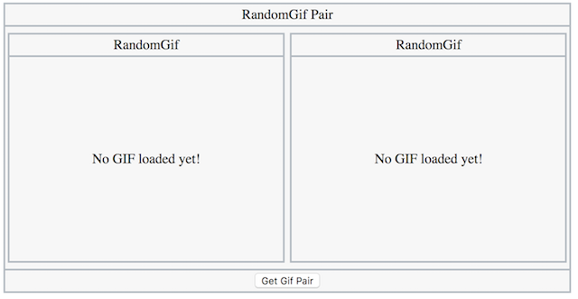

# Beginner Tutorial

## 1. Overview

This tutorial attempts to lead you through the simple process of creating a reusable component `RandomGif` (See below) and how to create a new component `RandomGifPair` by reusing the existing component using `fractal-component`. You might need some basic understandings of [ReactJs](https://reactjs.org/), [Redux](https://redux.js.org/introduction) & [Redux-Saga](https://redux-saga.js.org/). But don't worry if you haven't got a chance to look at those. As `fractal-component` tries to make things simplier by integrating with everyhting, you actually can pick up those concepts along the tutorial.

### 1.1 RandomGif Component


The `RandomGif` Component comes with a main display area that is for a Gif image and a `Get Gif` button. Once the button is clicked, this component will send a request to `https://giphy.com` to get a random gif image and display it in the display area. In the tutorial, we will try to create a highly decoupled component that doesn't make any assumptions on `outside world`. i.e.
- State Structure Independent: It doesn't rely on any particular state structure. The component's state can be moved to anywhere on the application's state tree without impacting its functionality. 
- Presentation Structure Independent: It doesn't require to be used within any particular React Component structure. i.e. It can be moved to anywhere within the Component tree without impact its functionality.
- Action Type Independent: Any action types defined by this component will never be coincidentally same with action types defined by any other components. 

### 1.2 RandomGifPair Component



The `RandomGifPair` Component will be built by reusing two `RandomGif` components. It comes with two image display areas and a `Get Gif Pair` button. Once the button is clicked, two gif images will be requested from `https://giphy.com` and displayed in the image display area. 

## 2. Initial Setup

Firstly, if you haven't install [NodeJs](https://nodejs.org/en/), you can download from here: https://nodejs.org/en/

Before we start, we need to clone the [Beginner Tutorial Repo](https://github.com/t83714/fractal-component-beginner-tutorial)

You can do so by:

```bash
git clone https://github.com/t83714/fractal-component-beginner-tutorial.git
```

You will want to checkout the `blank-template` branch to follow this tutorial (Complete demo code can be found from `master` branch).

```bash
cd fractal-component-beginner-tutorial
git checkout blank-template
```

To run the blank application, run:

```bash
npm start
```

After the application is started, you can access the application from:
```
http://localhost:3000/
```

you should see `Hello World!` in your browser.

## 3. RandomGif

### 3.1 Get Started

To start our `RandomGif` component, firstly, we need to create a `RandomGif` folder in `src` folder and then create `index.js` in `RandomGif` with the followings:

```javascript
import React from "react";
import { AppContainerUtils } from "fractal-component";

class RandomGif extends React.Component {
    constructor(props) {
        super(props);
        this.componentManager = AppContainerUtils.registerComponent(this, {
            namespace: "io.github.t83714/RandomGif"
        });
    }

    render() {
        return <div>Hello from RandomGif!</div>;
    }
}

export default RandomGif;
```

Here we define a React Component that may look very similar to an ordinary react component. The magic comes from the `constructor` method when we call [AppContainerUtils.registerComponent](/docs/api/AppContainerUtils.md#appcontainerutilsregistercomponent) to register the current component instance to `AppContainer`. Once register, a `Component Container` is created behind the scenes to maintain a more [advanced component structure](/docs/api/AppContainer.md#registercomponent). This more advanced component structure allows you to encapsulate `component state reducer`, `effects management`, `actions / events loop` etc. into a single `Component Container`. Here, to make it simple, we only create the `namespace` for our `Component Container` as suggested by line:
```javascript
namespace: "io.github.t83714/RandomGif"
```

### 3.2 Namespace

It's compulsory to specify a unique `namespace` for a `Component Container`. The `namespace` of a `Component Container` helps to make sure the `Component Container` state store & actions dispatch won't interfere other `Component Container`. 

A `Component Container` namespace is a string that may contain `/` character as namespace parts sperator. It's recommended that to construct the `Component Container Namespace` as `Reverse domain name notation` of your domain + `/` + `Component Name` to avoid name-space collisions. e.g. `io.github.t83714/RandomGif` as shown in sample above.

Please note: Here, the `Component Container Namespace` (e.g. `io.github.t83714/RandomGif` we supplied to `AppContainerUtils.registerComponent` method in sample code above ) is NOT the full runtime namespace (or we call `Full Namespace Path`). The `Full Namespace Path` will be automatically created for each `Component Container` instance using the following parts:
- `Namespace Prefix`: `fractal-component` will lookup this value from react component's `namespacePrefix` property (default value is empty string). It's an `interface` reserved for component users.  A component user can use it to put component namespace to a particular position to control action delivery without impacting component's internal logic. 
- `Component Container Namespace`: That's the namespace we specified when register component. e.g. `io.github.t83714/RandomGif`
- `Component ID`: It's a unique ID auto-generated to make sure any two `Component Containers`' `Full Namespaces` are different.

One example of the `Full Namespace Path` could be:
```
`Namespace Prefix`          `Namespace`                 `Component ID`
  exampleApp          /  io.github.t83714/RandomGif   /       c0
```

#### 3.2.1 Namespace Tree & Action Dispatch

All component `Full Namespace Paths` registered in an `AppContainer` forms a `Namespace Tree`. Below is an example of the `Namespace Tree` structure:


The `namespace` of the containers included in the diagram are:
- Component Container A:
    - Full namespace Path: `ExampleApp/GifPair/io.github.t83714/RandomGif/c0`
    - Namespace: `io.github.t83714/RandomGif`
    - Namespace Prefix: `ExampleApp/GifPair`
- Component Container B:
    - Full namespace Path: `ExampleApp/GifPair/io.github.t83714/RandomGif/c1`
    - Namespace: `io.github.t83714/RandomGif`
    - Namespace Prefix: `ExampleApp/GifPair`
- Component Container C:
    - Full namespace Path: `ExampleApp/io.github.t83714/Counter/c0`
    - Namespace: `io.github.t83714/Counter`
    - Namespace Prefix: `ExampleApp`

`fractal-component` allows actions to be dispatched from any namespace node in the namespace tree by specify the `relativeDispatchPath`. The `relativeDispatchPath` is calculated from `Full namespace Path` of a `Component Container`. i.e. Suppose `Component Container A` dispatches an action from `relativeDispatchPath`: 
```
../../..  (Up 3 levels from "ExampleApp/GifPair/io.github.t83714/RandomGif/c0")
```
Then, the actual action dispatch namespace node would be `ExampleApp/GifPair` in the `Namespace Tree`.

If the `relativeDispatchPath` is specified as `../../../*`, the action is a `multicast` action. For `multicast` actions, all lower levels namespace nodes will receive the actions. i.e. `multicast` actions will always be sent `down` the `Namespace Tree`. In this case, Container A & Container B will receive the `multicast` action.