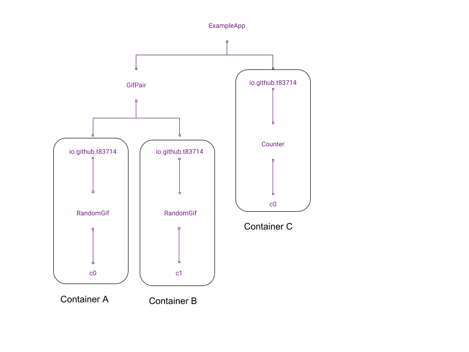

### 3.2 Namespace

It's compulsory to specify a unique `namespace` for a `Component Container`. The `namespace` of a `Component Container` helps to make sure the `Component Container` state store & actions dispatch won't interfere other `Component Container`. 

A `Component Container` namespace is a string that may contain `/` character as namespace parts sperator. It's recommended that to construct the `Component Container Namespace` as `Reverse domain name notation` of your registered domain + `/` + `Component Name` to avoid name-space collisions. e.g. `io.github.t83714/RandomGif` as shown in sample above.

Please note: Here, the `Component Container Namespace` (e.g. `io.github.t83714/RandomGif`) is NOT the full runtime namespace (or we call `Full Namespace Path`). The `Full Namespace Path` will be automatically created for each `Component Container` instance using the following parts:
- `Namespace Prefix`: `fractal-component` will lookup this value from react component's `namespacePrefix` property (default value is empty string). It's an `interface` reserved for component users.  A component user can use it to put component namespace to a particular position (of the `Namespace Tree`) to control action delivery without impacting component's internal logic. 
- `Component Container Namespace`: That's the namespace we specified when register component. e.g. `io.github.t83714/RandomGif`
- `Component ID`: It's a unique ID auto-generated to make sure any two `Component Containers`' `Full Namespace Paths` are different.

One example of the `Full Namespace Path` could be:
```
`Namespace Prefix`          `Namespace`                 `Component ID`
  exampleApp          /  io.github.t83714/RandomGif   /       c0
```

#### 3.2.1 Namespace Tree & Action Dispatch

The `namespace` system in `fractal-component` is similar to file system path. It consists of `namespace` path parts that are seperated by `/` delimiting character. It also supports relative path calculation:

> Suppose the `Full Namespace Path` of a component is `exampleApp/io.github.t83714/RandomGif/c0`
> A `relative path`: `../..` will be resolve to `exampleApp/io.github.t83714` for this component.

All registered (in an `AppContainer`) components' `Full Namespace Paths`   forms a `Namespace Tree`. Below is an example of the `Namespace Tree` structure:



The `namespace` of the containers included in the diagram are:
- Component Container A:
    - Full namespace Path: `ExampleApp/GifPair/io.github.t83714/RandomGif/c0`
    - Namespace: `io.github.t83714/RandomGif`
    - Namespace Prefix: `ExampleApp/GifPair`
- Component Container B:
    - Full namespace Path: `ExampleApp/GifPair/io.github.t83714/RandomGif/c1`
    - Namespace: `io.github.t83714/RandomGif`
    - Namespace Prefix: `ExampleApp/GifPair`
- Component Container C:
    - Full namespace Path: `ExampleApp/io.github.t83714/Counter/c0`
    - Namespace: `io.github.t83714/Counter`
    - Namespace Prefix: `ExampleApp`

`fractal-component` allows actions to be dispatched from any namespace node in the namespace tree by specify the `relativeDispatchPath`. The `relativeDispatchPath` is calculated from `Full namespace Path` of a `Component Container`. i.e. Suppose `Component Container A` dispatches an action from `relativeDispatchPath`: 
```
../../..  (Up 3 levels from "ExampleApp/GifPair/io.github.t83714/RandomGif/c0")
```
Then, the actual action dispatch namespace node would be `ExampleApp/GifPair` in the `Namespace Tree`.

If the `relativeDispatchPath` is specified as `../../../*`, the action is a `multicast` action. For `multicast` actions, all lower levels namespace nodes will receive the actions. i.e. `multicast` actions will always be sent `down` the `Namespace Tree`. In this case, Container A & Container B will receive the `multicast` action as they are lower level nodes of dispatch point `ExampleApp/GifPair`. Container C won't receive the actions.

There are two ways to dispatch namespaced actions in component:
- In component namespaced `saga`, you will need to `yield` a `take` `effect`. See [AppContainer / ManageableComponentOptions / saga / take](../../../api/AppContainer.md#manageablecomponentoptions)
- Outside `saga`, you can call [dispatch](../../../api/ComponentManager.md#dispatch) method of `ComponentManager`. 