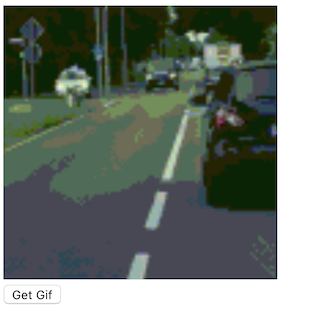

### 3.4 Request GIF / Namespaced Saga

In the section, we are going to implment the main logic of `RandomGif` component:
- UI includes a `Get Gif` button & a GIF image display area
- When click the button, the component should request remote API for a new GIF URL and display the GIF in the display area

Firstly, we need to update the initial component state to the followings (in `src/RandomGif/index.js`):
```javascript
this.state = {
    isLoading: false, //--- whether the component is requesting a GIF from remote server
    imageUrl: null, // --- received GIF image URL
    error: null // --- whether an error is captured during last network request
};
```

Then, the `render()` method needs to be updated with required UI (in `src/RandomGif/index.js`):
```javascript
render() {
    return (
        <div>
            <div>
                {/* Only show image when `this.state.imageUrl` is received */}
                {this.state.imageUrl &&
                    !this.state.isLoading &&
                    !this.state.error && (
                        
                    )}
                {(!this.state.imageUrl || this.state.isLoading) &&
                    !this.state.error && (
                        <p>
                            {this.state.isLoading
                                ? "Requesting API..."
                                : "No GIF loaded yet!"}
                        </p>
                    )}
                {this.state.error && (
                    <p>{`Failed to request API: ${this.state.error}`}</p>
                )}
            </div>
            <div>
                <button
                    onClick={() => {
                        this.componentManager.dispatch(
                            // --- dispatch `REQUEST_NEW_GIF` action
                            actions.requestNewGif()
                        );
                    }}
                    disabled={this.state.isLoading}
                >
                {/* When requesting API, the button shows  `Requesting API...` */}
                    {this.state.isLoading ? "Requesting API..." : "Get Gif"}
                </button>
            </div>
        </div>
    );
}
```

To implement our logic, we need to define the following action types (in `src/RandomGif/actions/types.js`):
```javascript
// --- Trigger by `Get Gif` button. `Saga` monitor this action to trigger network request
export const REQUEST_NEW_GIF = Symbol("REQUEST_NEW_GIF");

// --- Once a GIF url is received, this action will be used to update `this.state` via reducer
export const RECEIVE_NEW_GIF = Symbol("RECEIVE_NEW_GIF");

// --- Update state with any possible error during the network request
export const REQUEST_NEW_GIF_ERROR = Symbol("REQUEST_NEW_GIF_ERROR");
```

And define the following action creators (in `src/RandomGif/actions/index.js`):
```javascript
import * as actionTypes from "./types";

export function requestNewGif() {
    return {
        type: actionTypes.REQUEST_NEW_GIF
    };
}

export function receiveNewGif(imgUrl) {
    return {
        type: actionTypes.RECEIVE_NEW_GIF,
        payload: imgUrl
    };
}

export function requestNewGifError(error) {
    return {
        type: actionTypes.REQUEST_NEW_GIF_ERROR,
        payload: error
    };
}
```

Next, we need to update `reducer` with the following logic:
```javascript
import * as actionTypes from "../actions/types";

const reducer = function(state, action) {
    switch (action.type) {
        case actionTypes.REQUEST_NEW_GIF:
        // --- when receive `REQUEST_NEW_GIF`, set state.isLoading to true
        // --- and error to null
            return {
                ...state,
                isLoading: true,
                error: null
            };
        case actionTypes.RECEIVE_NEW_GIF: {
        // --- Update state.imageUrl with received GIF image URL
            const imageUrl = action.payload;
            return {
                ...state,
                isLoading: false,
                error: null,
                imageUrl
            };
        }
        case actionTypes.REQUEST_NEW_GIF_ERROR:
        // --- Update state.error with any errors during the network request
            return {
                ...state,
                isLoading: false,
                error: action.payload
            };
        default: return state;
    }
};
export default reducer;
```

Next, we need to create a `saga` to:
- monitor the `REQUEST_NEW_GIF` and request API
- Dispatch `RECEIVE_NEW_GIF` with API request result (the GIF url)
- Dispatch `REQUEST_NEW_GIF_ERROR` with any possible error

A `saga` is a [Generator Function](https://developer.mozilla.org/en-US/docs/Web/JavaScript/Reference/Statements/function*) run an event loop or managing side-effects. It is run by [redux-saga](https://redux-saga.js.org) internally. In the `saga`, you can use [yield operator](https://developer.mozilla.org/en-US/docs/Web/JavaScript/Reference/Operators/yield) to `yield` a `effect description object`. `redux-saga` will creata the effect, get result back to you via the return value of the `yield operator` and resume your `saga`'s execution. More info on this can be found from [ManageableComponentOptions.saga](../../../api/AppContainer.md#manageablecomponentoptions)

When your `saga` is run, an `effects` parameter is passed to your `saga` contains a list of `effect creator functions`. You can use the provided `effect creator functions` to create effects.

You can create a file (`src/RandomGif/sagas/index.js`) with the followings:
```javascript
import * as actionTypes from "../actions/types";
import * as actions from "../actions";

// --- request `giphy` API for random GIF url
// --- return a Promise
function fetchGif(apiKey) {
    return fetch(
        `https://api.giphy.com/v1/gifs/random?api_key=${apiKey}`
    ).then(response => response.json()).catch(error=>{
        throw new Error("Giphy API key is invalid or exceeded its daily / hourly limit.");
    });
}

const mainSaga = function*(effects) {
    try{
        while(true){
            // --- create an effect of taking an `REQUEST_NEW_GIF` action 
            // --- from this Component's action channel
            // --- Until an action is available for being taken, this saga will not resume its execution.
            const action = yield effects.take(actionTypes.REQUEST_NEW_GIF);
            // --- Create an `call` effect to execute a sub-routine
            // --- Your saga will not resume until sub-routine is complete
            // --- If you don't want the sub-routine block your saga's execution,
            // --- you can create a `fork` effect instead
            // --- you should put a correct API key here instead of `xxxxxxxxxxxx`
            const response = yield effects.call(fetchGif, "xxxxxxxxxxxx"); 
            const imgUrl = response.data.fixed_width_small_url;
            // --- dispatch an action with new img Url as payload
            yield effects.put(actions.receiveNewGif(imgUrl));
        }
    }catch(e){
        yield effects.put(actions.requestNewGifError(e));
    }
};
export default mainSaga;
```

You may notice that we used a `while(true)` loop for monitor all `REQUEST_NEW_GIF` action. You don't need to worry about this `while` loop. It won't occupy the main thread of the web browser and cause any render issue as line:
```javascript
const action = yield effects.take(actionTypes.REQUEST_NEW_GIF);
```
will not return until a `REQUEST_NEW_GIF` is received.

You don't have to always write a `while(true)` `event loop`. You can use: [takeEvery](https://github.com/redux-saga/redux-saga/tree/v1.0.0-beta.2/docs/api#takeeverypattern-saga-args), [takeLatest](https://github.com/redux-saga/redux-saga/tree/v1.0.0-beta.2/docs/api#takelatestpattern-saga-args) or [takeLeading](https://github.com/redux-saga/redux-saga/tree/v1.0.0-beta.2/docs/api#takeleadingpattern-saga-args) effect creator to acheive the similar function. They are provided as shortcut and implmented using `take` effect. e.g. the above `while` loop can also be re-written to:
```javascript
const mainSaga = function*(effects) {
    yield effects.takeLeading(actionTypes.REQUEST_NEW_GIF, function*(action) {
        try{
            const response = yield effects.call(fetchGif, "xxxxxxxxxxxx"); 
            const imgUrl = response.data.fixed_width_small_url;
            yield effects.put(actions.receiveNewGif(imgUrl));
        }catch(e){
            yield effects.put(actions.requestNewGifError(e));
        }
    });
};

```


In the end, you can add the `saga` into your `Component Container` via [ManageableComponentOptions.saga option](../../../api/ManageableComponentOptions.md)

```javascript
import React from "react";
import { ComponentManager } from "fractal-component";
import * as actionTypes from "./actions/types";
import reducer from "./reducers";
import * as actions from "./actions";
import saga from "./sagas";

class RandomGif extends React.Component {
    constructor(props) {
        super(props);
        this.state = {
            isLoading: false,
            imageUrl: null,
            error: null
        };
        this.componentManager = new ComponentManager(this, {
            namespace: "io.github.t83714/RandomGif",
            actionTypes,
            reducer,
            // --- register saga
            saga
        });
    }

    render() { ... }
}

export default RandomGif;
```

If you run the app via `npm start`, you will find that once click the `Get Gif` button, a GIF image is shown in the display area.

