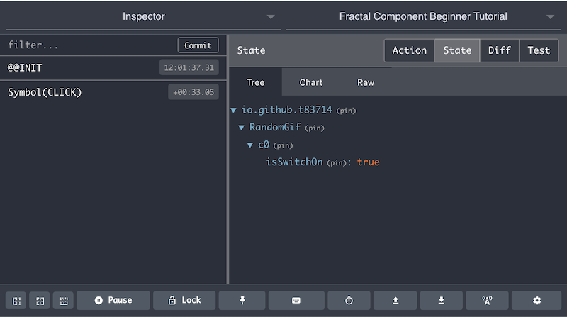

### 3.3 A simple Switch / Namespaced State

Next, let's add a simple switch function to our `RandomGif` component. It's not part of required functionalities of our `RandomGif` component. However, implemnt this simple function will help us to understand the some basics that `fractal-component` brought to the component state management area.

Firstly, we want to modify `src/RandomGif/index.js` to add a `switch` button & initialise component state:
```javascript
import React from "react";
import { AppContainerUtils } from "fractal-component";

class RandomGif extends React.Component {
    constructor(props) {
        super(props);
        // --- Component state need to be initialised
        // --- before `registerComponent` method call
        this.state = {
            isSwitchOn: false
        };
        this.componentManager = AppContainerUtils.registerComponent(this, {
            namespace: "io.github.t83714/RandomGif"
        });
    }

    render() {
        return (
            <button onClick={() => {}}>
                {this.state.isSwitchOn ? "Switch ON" : "Switch OFF"}
            </button>
        );
    }
}

export default RandomGif;
```

To make the button clickable and display correct status (`Switch ON` or `Switch OFF`), we just need to mutate component state `this.state` and make sure `this.state.isSwitchOn` has been set correct value (`true` or `false`) when the button is clicked.

In a React Component, to achieve that, we usually can mutate `this.state` by calling `this.setState` method. However, for a `ComponentManager` managed component, we cannot do that because `this.state` is actually managed by the `ComponentManager` and it's part of [global application Redux state store](https://redux.js.org/basics/store). In fact, if you try to call `this.setState` in a managed component, you will get an Error:

>Error: This component is managed by `fractal-component`. You should dispatch action to mutate component state.

i.e. If you want to mutate the component state `this.state`, you should trigger an action and mutate the component state in a `namespaced` component [reducer](https://redux.js.org/basics/reducers). You can provide this reducer when call [AppContainerUtils.registerComponent](../../../api/AppContainerUtils.md#appcontainerutilsregistercomponent) method.

Next, you need to define the [Action](https://redux.js.org/basics/actions) before we can dispatch the action in `onClick` event handler of our switch button. To do so, we need to create a file `src/RandomGif/actions/types.js` with the `Action Type` definition:
```javascript
export const CLICK = Symbol("CLICK");
```

Here, `fractal-component`'s action dispatch system requires all action types are [Symbols](http://2ality.com/2014/12/es6-symbols.html). A Redux App usually won't define `Action Type` as `Symbols` as they are not serialisable and you will need to serialise `Actions` when you try to implement [Time Travel](https://www.ibm.com/developerworks/library/wa-manage-state-with-redux-p4-david-geary/index.html#N10076) alike features in your app. However, `fractal-component` has sovled this by providing an `Action` serialisation / de-serialisation solution via its `ActionRegistry`. See [AppContainerUtils.serialiseAction](../../../api/AppContainerUtils.md#appcontainerutilsserialiseaction) & [AppContainerUtils.deserialiseAction](../../../api/AppContainerUtils.md#appcontainerutilsdeserialiseaction) for more info.

Next, create a file `src/RandomGif/actions/index.js` with all action creator function definitions for your component:
```javascript
import * as actionTypes from "./types";

export function click() {
    return {
        type: actionTypes.CLICK
    };
}
```

Then, we will need to create our `reducer` in `src/RandomGif/reducers/index.js`:
```javascript
import * as actionTypes from "../actions/types";

const reducer = function(state, action) {
    switch (action.type) {
        case actionTypes.CLICK:
            return {
                ...state,
                isSwitchOn: state.isSwitchOn ? false : true
            };
        default:
            return state;
    }
};
export default reducer;
```

You probably have noticed that the reducer is a `namespaced` reducer. i.e. 
- It only receives the actions that the component receives.
- It only sees the component state `this.state`.

We now can complete our `switch button` feature by importing everything above into `src/RandomGif/index.js`:

```javascript
import React from "react";
import { AppContainerUtils } from "fractal-component";
import * as actionTypes from "./actions/types";
import reducer from "./reducers";
import { click } from "./actions";

class RandomGif extends React.Component {
    constructor(props) {
        super(props);
        this.state = {
            isSwitchOn: false
        };
        this.componentManager = AppContainerUtils.registerComponent(this, {
            namespace: "io.github.t83714/RandomGif",
            // --- register all action types so that actions are serialisable
            actionTypes,
            reducer
        });
    }

    render() {
        return (
            <button onClick={() => {
                this.componentManager.dispatch(click());
            }}>
                {this.state.isSwitchOn ? "Switch ON" : "Switch OFF"}
            </button>
        );
    }
}

export default RandomGif;
```
> Please note: In order to make your component actions serialisable, you need to register all your component action types via `AppContainerUtils.registerComponent` method's [ManageableComponentOptions.actionTypes](../../../api/AppContainer.md#manageablecomponentoptions)

If you run the app via `npm start`, you will find the button text will reflects the `switch status` along your clicks. You can open the [Redux Devtool](https://github.com/zalmoxisus/redux-devtools-extension) to observe the component state changes.

