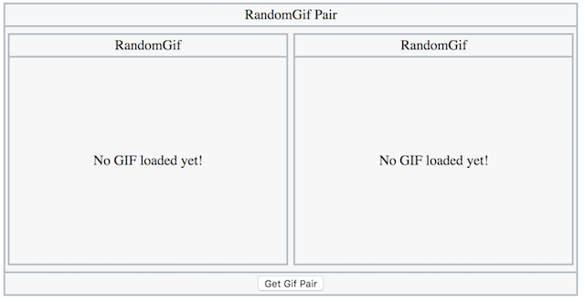

## 4 RandomGifPair

In this section, we are going to demonstrate how to reuse `RandomGif` component to create a new reusable `RandomGifPair`. The new `RandomGifPair` component will come with two image display areas and a Get Gif Pair button. Once the button is clicked, two gif images will be requested from https://giphy.com and displayed in the image display area.

- [4.1 Get Started](./GetStarted.md)
- [4.2 Incoming / Outgoing Actions](./IncomingOutgoingActions.md)

